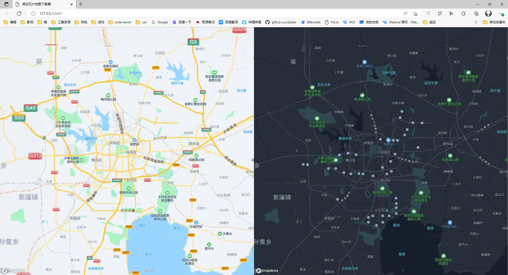

# tencent-map-downloader

疼逊瓦片地图下载器



## 安装

```
npm ci
```

## 快速开始

1. 访问 [腾讯在线地图选点工具](https://lbs.qq.com/getPoint/) 复制目标区域的左上角和右下角的经纬度。
2. 修改`index.ts`中`p1, p2`的值(可以进一步自定义`quickStart`的参数)。
3. 运行`npm start`等待地图下载。
4. 运行`npm run preview`启动 web 服务，预览地图。

## 进阶

`index.ts`中的`quickStart`工具函数是对`src/downloader`函数的简单封装，足以应付大部分场景。

您也可以选择不使用`quickStart`，直接对`downloader`进行调用，以实现进阶需求。

## 其他

- 本工具仅供编程学习、交流使用。若由于其他使用形式引发不良后果，请自行承担。
- 中国全境地图坐标参考：53.92237,72.682357 | 14.789894,135.70137
- 合肥市区坐标参考：32.02375,116.974057 | 31.695634,117.635832
